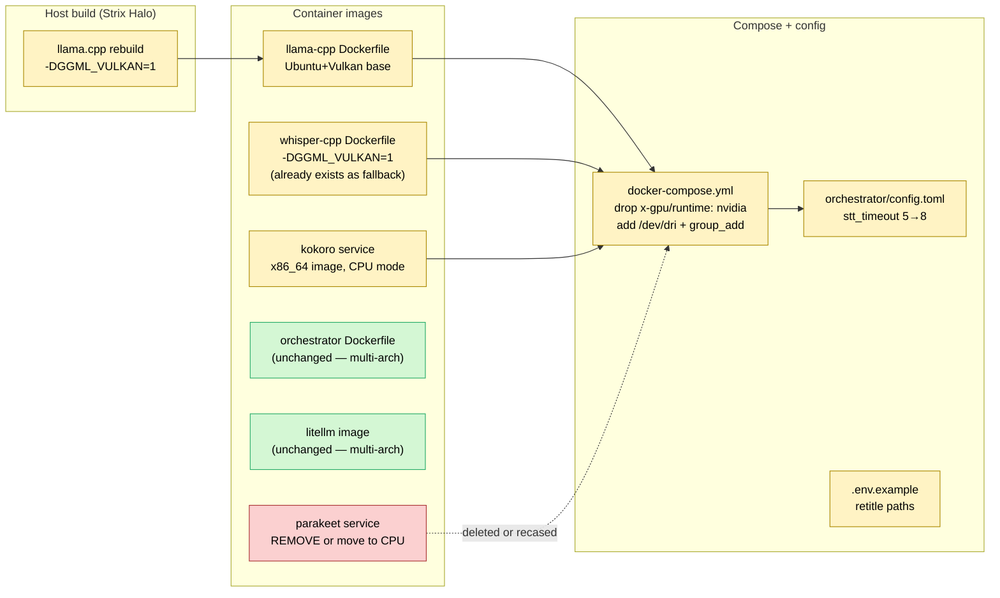

# Strix Halo port — feasibility notes

> **Note (2026-06-10):** this plan was written against the *original* DGX stack
> (llama.cpp GGUF, ~65 tok/s). The DGX has since migrated to **Qwen3.6-35B-A3B-NVFP4
> on vLLM** (~70 tok/s, MARLIN FP4). A Strix Halo port would need re-baselining —
> vLLM NVFP4 targets Blackwell FP4 tensor cores, not AMD; the Vulkan-llama.cpp path
> below is the relevant analogue. Baseline numbers here are historical.

**Status:** discussed, plan drafted and refined, **not yet ready to proceed**.
No green-light to build. Holding for a later decision on whether Strix Halo is the
right target hardware before committing engineering time. The plan below can be
picked up as-is when that decision is made.

**Origin:** initial scoping drafted in-session, then refined remotely via
Ultraplan (session
[01X7eutWttHfKTMxrsSTBDva](https://claude.ai/code/session_01X7eutWttHfKTMxrsSTBDva?from=cli)).
This file is the merged result, kept in the repo for reference.

---

## Context

WetCourt's AI server today is a CUDA-only Docker stack running on an arm64 DGX
Spark (GB10 Grace Blackwell, sm_121, CUDA 13, ~121 GiB unified memory). Scoping
question: what would it take to port to a **Strix Halo** box (Ryzen AI Max+
395: Zen 5 16-core + Radeon 8060S iGPU on gfx1151 + XDNA 2 NPU, up to 128 GB
unified LPDDR5X-8000, ~256 GB/s memory bandwidth, x86_64).

Direction set at scoping time:
- **Output:** feasibility scoping only — survey + risk doc, no build.
- **Component flexibility:** free to swap Parakeet and to rebuild Kokoro for x86_64.
- **LLM backend:** plan around **Vulkan** (portable, in llama.cpp upstream, simpler than ROCm).

## Stack today (verified from the repo)

```
LAN ─► :4000  litellm  ─┬─ /v1/chat/completions     ─► llama-server :8000   (Qwen3.6-35B-A3B Q4_K_M, CUDA)
                       ├─ /v1/audio/speech          ─► kokoro       :8880   (Kokoro-FastAPI arm64, PyTorch CUDA)
                       └─ /v1/audio/transcriptions  ─► parakeet     :8082   (NeMo ASR, PyTorch CUDA, nvcr base)
                                                       │
                                                  orchestrator :8080      (Rust + React, multi-arch Dockerfile)
```

Notable details discovered while exploring:
- `dgx-ai-stack/llama-cpp/Dockerfile` is a **packaging shim**: it does *not*
  build llama.cpp. It pulls a pre-built `llama-server` + libs from
  `LLAMA_BUILD_CONTEXT` (a host-side llama.cpp build dir, set in `.env`).
  Switching backends means rebuilding on the host with new cmake flags, then
  the Dockerfile changes are just base-image + LD_LIBRARY_PATH cleanup.
- `dgx-ai-stack/whisper-cpp/Dockerfile` *does* build whisper.cpp inside the
  image with `-DGGML_CUDA=1` and is already plumbed as a "fallback STT, not
  in active compose" (per `dgx-ai-stack/README.md` lines 31–32, 197–198).
- `orchestrator/Dockerfile` uses `node:20-bookworm`, `rust:1-bookworm`, and
  `debian:bookworm-slim` — all multi-arch. No platform pin. Buildx handles
  the target arch; no Rust target swap or code change needed.
- `orchestrator/src/inference/client.rs:60–80` streams TTS via OpenAI-shaped
  `/v1/audio/speech` with `response_format: "pcm"`. Any TTS backend that
  speaks that contract is drop-in; backend choice is fully behind LiteLLM.

## Port-story shape



Green = no change. Yellow = work. Red = remove or rework.

## Per-component port assessment

### 1. `llama-server` (Qwen3.6-35B-A3B GGUF Q4_K_M) — **Low risk**

Files: `dgx-ai-stack/llama-cpp/Dockerfile`, host-side llama.cpp checkout

- Host rebuild of llama.cpp: `cmake -B build -DGGML_VULKAN=1 -DGGML_CUDA=0`.
  All the existing run flags carry over — `--n-gpu-layers 99`, `--flash-attn on`,
  `--jinja`, `--ctx-size`, `-m /models/...` are backend-agnostic.
- Dockerfile: replace `nvcr.io/nvidia/cuda:13.0.0-runtime-ubuntu24.04` with
  `ubuntu:24.04`; install `libvulkan1`, `mesa-vulkan-drivers`, `vulkan-tools`;
  drop `--platform=linux/arm64`; drop the `NVIDIA_*` env vars; keep the COPY
  of `llama-server` + `lib*.so*` from `LLAMA_BUILD_CONTEXT`.
- **Open Q — Vulkan memory budget.** Mesa+amdgpu on Strix Halo has historically
  capped Vulkan-visible memory at a UMA carveout (often ~50 % of system RAM).
  Recent kernels lift it on APUs. Verify `vulkaninfo` heap budgets cover
  ~20 GiB GGUF + KV cache + activation buffers before committing. *Fallback:*
  drop to a smaller Qwen3 (8B–14B), or move to ROCm 6.4+ which doesn't carve
  out UMA the same way on gfx1151.
- **Open Q — prefill latency.** Vulkan prefill is typically slower than CUDA.
  Booth prompts are long (system prompt + charge + plea transcript). Benchmark
  a representative prompt before declaring the budget safe; mitigations are
  `--prompt-cache` on the static system prompt or moving to ROCm.
- **Expected perf.** Decode is memory-bound. Strix Halo's ~256 GB/s vs Spark's
  ~273 GB/s on the unified LPDDR5X means **decode ≈ 0.5–0.9× of Spark**
  depending on Vulkan kernel overhead — i.e. ~35–60 tok/s vs ~65 tok/s today.
  Verdict TTFB likely 2–3 s vs ~1.3 s. Still inside the <8 s booth budget but
  margin shrinks; characterize before claiming victory.

### 2. STT — **Three viable paths; pick after a short bench** — **Low risk**

Files: `dgx-ai-stack/parakeet/`, `dgx-ai-stack/whisper-cpp/Dockerfile`,
`dgx-ai-stack/litellm/config.yaml`

Three options. They are mutually exclusive but all keep the OpenAI
`/v1/audio/transcriptions` shape the orchestrator already speaks
(`orchestrator/src/inference/client.rs:42`).

**Option A — Parakeet on CPU**
- NeMo ASR models support CPU inference (`asr_model.to('cpu')`). Parakeet-TDT
  0.6B is ~600M params; in fp32 ≈ 2.4 GiB resident, fp16 ≈ 1.2 GiB.
- Rebuild the parakeet image off an x86_64 PyTorch CPU base (e.g.
  `pytorch/pytorch:2.5.1-cpu` or plain `python:3.11` + `torch --index-url
  https://download.pytorch.org/whl/cpu`). Drop the NGC `nvcr.io/nvidia/pytorch`
  base. Drop the `NVIDIA_*` env. One-line change in `server.py`:
  `asr_model = nemo_asr.models.ASRModel.from_pretrained(...).to('cpu').eval()`.
- **Expected latency on Zen 5 16-core:** ~1.5–3 s warm for a 25 s clip
  (roughly 8–15× slower than Spark's 220 ms; CPU NeMo inference scales
  linearly with cores up to ~8 threads in practice). Bump
  `stt_timeout_secs` 5 → 8.
- **Why this is attractive:** preserves the better-on-accents accuracy
  that the README explicitly calls out (line 121), and keeps the iGPU and
  its VRAM carve-out available for the LLM, which is bandwidth-starved.
- **Caveat:** NeMo's CPU path has occasional NumPy/PyTorch version-pinning
  pain. Verify the existing `numpy<2` + NeMo 2.2 combo cleanly builds on
  x86_64 + CPU-only torch.

**Option B — whisper.cpp on Vulkan** *(already plumbed as fallback)*
- Existing `dgx-ai-stack/whisper-cpp/Dockerfile` builds whisper.cpp with
  `-DGGML_CUDA=1`. Swap to `-DGGML_VULKAN=1`, drop the CUDA base, drop the
  `--platform=linux/arm64`, drop `LIBRARY_PATH=stubs` and `CMAKE_CUDA_ARCH`.
- Model: `ggml-large-v3-turbo` (1.4 GiB), already referenced.
- **Expected latency warm:** ~600 ms–1.5 s / 25 s on the 8060S via Vulkan.
- **Quality regression vs Parakeet on accents** is the real cost; bench it
  against real booth recordings.

**Option C — sherpa-onnx (zipformer) on CPU or with onnxruntime-vulkan EP**
- Only if Parakeet-on-CPU accuracy *and* whisper.cpp accuracy are both
  unacceptable. Streaming-friendly, fast on CPU, but a new dependency.

**Recommendation:** start with **A (Parakeet on CPU)** — it's the smallest
behavioral change. Fall back to B (whisper.cpp on Vulkan) if CPU latency
blows the booth budget. The whisper.cpp Dockerfile already exists.

### 3. TTS — **Kokoro x86_64 on CPU is the cleanest answer** — **Low risk**

Files: `dgx-ai-stack/docker-compose.yml` (kokoro service env + image),
`dgx-ai-stack/litellm/config.yaml` (unchanged — already
`http://kokoro:8880/v1`).

Kokoro runs natively on x86_64 without an NVIDIA GPU, in multiple ways:

- **CPU (recommended).** Kokoro is 82M params. Kokoro-FastAPI ships
  multi-arch images and a `USE_GPU=false` mode. On Zen 5 16-core, expect
  per-sentence TTFB **300–700 ms** vs ~300 ms on Spark GPU. Sentence-level
  pipelining (already done) hides this.
- **ONNX on CPU.** There's a community ONNX export of Kokoro — even faster
  on CPU than PyTorch. Plug-replacement at the model layer.
- **AMD GPU (PyTorch ROCm).** Available on gfx1151 with ROCm 6.4+; not
  recommended for this port because Kokoro is small enough to not need it
  and ROCm adds heavy install surface.

Concrete changes:
- Drop the `image: kokoro-tts-arm64:latest` line and switch to the upstream
  `ghcr.io/remsky/kokoro-fastapi-cpu:latest` (multi-arch, CPU-only build),
  or build locally from the Kokoro-FastAPI repo for x86_64.
- Remove `USE_GPU: "true"` and `DEVICE: cuda` from the compose env.
- Remove `<<: *gpu` from the kokoro service (no GPU runtime needed).

Frontier TTS options on AMD GPU (for later, not this port):

| Model            | Params | AMD GPU path           | Notes                                                                      |
|------------------|--------|------------------------|----------------------------------------------------------------------------|
| **Kokoro 82M**   | 82M    | PyTorch ROCm or CPU    | What you have. CPU is plenty fast at this size.                            |
| Coqui XTTS-v2    | ~1.8B  | PyTorch ROCm           | Multi-speaker + voice cloning; higher quality, slower TTFB.                |
| F5-TTS           | ~330M  | PyTorch ROCm           | Strong zero-shot voice cloning; active development.                        |
| Parler-TTS Large | ~2.3B  | PyTorch ROCm           | Transformer; controllable via natural-language style prompts.              |
| StyleTTS2        | ~150M  | PyTorch ROCm           | Very fast; expressive prosody.                                             |
| Orpheus 3B       | 3B     | vLLM-ROCm              | Already failed once in this repo (vLLM init on Blackwell). vLLM ROCm path  |
|                  |        |                        | exists for gfx1151 but is fiddly. Same wrapper deadlock would recur.       |
| Piper (CPU-only) | tiny   | n/a (CPU/ONNX)         | Listed because it's the realistic floor if even Kokoro CPU is too slow.    |

**Recommendation:** stay on Kokoro CPU for the port. If voice quality
later demands an upgrade, **F5-TTS on ROCm** is the most credible
"frontier-ish" jump without dragging in vLLM. Don't reattempt Orpheus
until vLLM's ROCm + sync-wrapper situation matures.

### 4. LiteLLM router — **No-op**

`ghcr.io/berriai/litellm:main-stable` already publishes x86_64 manifests.
Compose entry doesn't change. `litellm/config.yaml` only changes if the
service hostname changes; it doesn't (parakeet → could keep the same
service name to avoid touching config; recommended).

### 5. Rust orchestrator — **No-op**

`orchestrator/Dockerfile` is multi-arch. Build with
`docker buildx build --platform linux/amd64`. The Rust toolchain inside
the image picks the right target automatically. No code changes.

### 6. `dgx-ai-stack/docker-compose.yml` — **Moderate**

- Delete the `x-gpu` anchor block (lines 3–11).
- Remove `<<: *gpu` from `llama-server`, `parakeet`/STT replacement, and
  `kokoro`.
- For services that need iGPU (llama-server on Vulkan, optionally a Vulkan
  whisper.cpp), add:
  ```yaml
  devices: ["/dev/dri:/dev/dri"]
  group_add: ["video", "render"]
  ```
- If keeping Parakeet on CPU: no device passthrough at all on that service.
- No `/dev/kfd` needed (that's a ROCm-only device).
- `parakeet-cache` volume stays if we keep Parakeet; remove if we move to
  whisper.cpp.

### 7. `orchestrator/config.toml` — **Trivial**

- `stt_timeout_secs = 5` → `8` (covers CPU Parakeet warm latency).
- `verdict_total_timeout_secs = 30` → `40` while characterizing perf
  (revert after benchmarking).
- No semantic changes; `inference.base_url` and model aliases stay.

### 8. `.env.example` — **Trivial**

- `AI_STACK_HOST=user@dgx-spark.local` → `user@strix-halo.local` (or
  whatever the new host is named).
- `LLAMA_BUILD_CONTEXT` now points at a Strix-side Vulkan llama.cpp build.

## What does **not** carry over

- NeMo NGC-PyTorch base image (`nvcr.io/nvidia/pytorch:25.11-py3`) and
  `nvcr.io/nvidia/cuda:13.0.0-runtime` — replace with Ubuntu + Vulkan, or
  with a vanilla x86_64 PyTorch CPU image for Parakeet.
- `--platform=linux/arm64` pins in `llama-cpp/Dockerfile` and
  `whisper-cpp/Dockerfile`.
- `LLAMA_BUILD_CONTEXT` pointing at an arm64 CUDA llama.cpp build —
  rebuild Vulkan llama.cpp on the Strix host.
- The `x-gpu` compose anchor (`runtime: nvidia`, `driver: nvidia`).
- `sm_121`/Blackwell-tuned knobs — `n-gpu-layers`, batch size, KV cache
  sizing may need retuning, even if the flag names don't change.

## Risks and unknowns (ordered by severity)

1. **Vulkan UMA carveout on Strix Halo.** Check `vulkaninfo` heap budgets
   on a representative kernel/mesa combo before committing to Qwen3.6-35B.
   *Fallback:* smaller model, or ROCm.
2. **Vulkan prefill latency with the booth's long prompts.** Bench
   end-to-end on a real charge+plea prompt; mitigations are prompt-cache,
   prompt shortening, or ROCm.
3. **STT accuracy regression.** README explicitly notes Parakeet beats
   whisper.cpp on accents (line 121). Bench against booth recordings.
4. **Parakeet CPU build pain.** NeMo+CPU+Python deps occasionally fight.
   Have whisper.cpp-on-Vulkan as the documented fallback.
5. **Thermals.** Strix Halo sustained 90–120 W is ~2.5× Spark's load.
   Booth enclosure airflow needs re-evaluation.
6. **NPU is out of scope.** XDNA 2 (~50 TOPS INT8) is real but the
   Ryzen AI SW / onnxruntime EP stack for LLMs/ASR is still maturing.
   Future upside, not a port dependency.

## Verification (when/if a build happens later)

For each component, end-to-end checks against the existing booth flow:

1. `llama-server`: hit `/v1/chat/completions` with the verdict prompt;
   measure TTFT, decode tok/s, total. Baseline: TTFT ~300 ms,
   ~65 tok/s, ~2 s total. Target: TTFT < 1 s, decode > 30 tok/s.
2. STT: feed `sample_plea.wav` (already in the repo root) to
   `/v1/audio/transcriptions`; compare transcript WER to the Parakeet
   ground truth; measure warm latency vs `stt_timeout_secs`.
3. Kokoro: synthesize one verdict sentence; measure TTFB; confirm
   24 kHz s16le PCM still streams cleanly to the browser
   (`orchestrator/src/inference/client.rs:60`).
4. Orchestrator + frontend: run `sample-benchmark.py --runs 20
   --no-think` in `mock` hardware mode; verify p95 end-to-end inside the
   <8 s booth budget.
5. Confirm `docker compose up` cleanly maps `/dev/dri` into the GPU
   services, and `vulkaninfo` inside those containers reports the
   Radeon 8060S.

## Critical files to touch (when a build happens)

| File | Change |
|---|---|
| `dgx-ai-stack/llama-cpp/Dockerfile` | Ubuntu+Vulkan base; drop arm64 + NVIDIA env |
| `dgx-ai-stack/whisper-cpp/Dockerfile` | (only if Option B) `-DGGML_VULKAN=1`, drop CUDA, drop arm64 |
| `dgx-ai-stack/parakeet/Dockerfile` | (Option A) base off `python:3.11`/CPU torch; drop NVIDIA env |
| `dgx-ai-stack/parakeet/server.py` | (Option A) one-line `.to('cpu')` |
| `dgx-ai-stack/docker-compose.yml` | drop `x-gpu`; add `/dev/dri` + `group_add` for GPU services |
| `dgx-ai-stack/litellm/config.yaml` | only changes if STT service is renamed |
| `dgx-ai-stack/.env.example` | retitle host, retitle `LLAMA_BUILD_CONTEXT` |
| `orchestrator/config.toml` | `stt_timeout_secs 5→8`, optionally `verdict_total_timeout_secs 30→40` |
| `orchestrator/Dockerfile` | **no change** (multi-arch already) |
| `dgx-ai-stack/README.md`, `wet-court-architecture.md` | update hardware/deployment notes |

## Bottom line

**Port is feasible without exotic work.** Real engineering tasks: (1)
rebuild llama.cpp on Vulkan and verify memory + prefill budgets, (2)
move Parakeet to CPU (or fall back to whisper.cpp-on-Vulkan) and absorb
some STT latency drift, (3) repackage Kokoro on a CPU x86_64 image.
Everything else (orchestrator, LiteLLM, compose passthrough, config
bumps) is routine.

The biggest unknown isn't the toolchain — it's whether Strix Halo's
~0.5–0.9× decode-bandwidth ratio plus Vulkan prefill keeps the booth's
<8 s end-to-end budget intact at the long tail. A half-day Vulkan
benchmark on a representative prompt + a 25 s `sample_plea.wav` STT
run would settle that before any build work begins.
